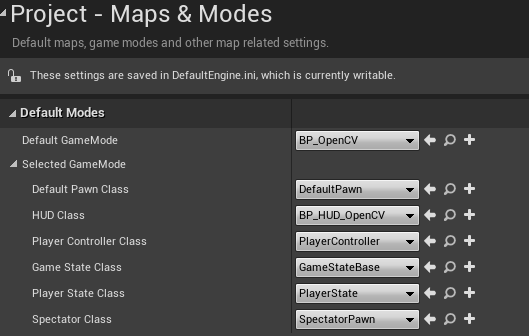

# OpenCV Integration with Unreal Engine

This guide will first outline the workflow to install OpenCV C++ and Zbar libraries in Visual Studio 2019 as a standalone project. Further in the guide, we will setup up an Unreal Engine project that detects QR codes for devices built on the Windows x64 platform. 

If you would like to build this project on x86 or ARM, you will need to download or cross-compile the OpenCV and Zbar libraries to match the desired platform. 

## Prerequisites

Note: You may want to build the OpenCV and ZBar libraries yourself to work for different targeted architectures such as `ARM`, and `ARM64`. OpenCV comes compiled in `x64` while ZBar 0.10 is compiled in `x86`. Below we use a `x64` ported version of ZBar and the pre-built OpenCV library files for simplicity of installation. 

1. Install [Visual Studio 2019 Community.](https://visualstudio.microsoft.com/free-developer-offers/)

2. Install OpenCV from the official website [here.](https://opencv.org/releases/) The version that will be used is `OpenCV – 4.5.2`. Download the `opencv-4.5.2-vc14_vc15.exe` Windows executable and run to extract to a desired file path. The path we will use here is `C:\`

3. Git clone `ZBarWin64` from this repository [here.](https://github.com/dani4/ZBarWin64) The path we will use here is `C:\`

Resources on OpenCV:
- [OpenCV Documentation](https://docs.opencv.org/master/d9/df8/tutorial_root.html)
- [OpenCV Releases](https://opencv.org/releases/)
- [OpenCV Repository](https://github.com/opencv/opencv)
- [OpenCV Installation and Building from source](https://docs.opencv.org/master/d3/d52/tutorial_windows_install.html#tutorial_windows_gitbash_build)
- [OpenCV Nuget](https://www.nuget.org/packages?page=2&q=opencv&sortBy=relevance)

Resources on ZBar and Source Code:  
- [ZBar Source Forge (version 0.1)](http://zbar.sourceforge.net/)  
- [ZBar Repository (version 0.20+)](https://git.linuxtv.org/zbar.git)
- [ZBar API documentation](http://zbar.sourceforge.net/api/annotated.html)
## Add OpenCV and ZBar to your `PATH` enviornment variable. 

We do this by going to:  
`Control Panel -> System Properties -> Advanced -> Enviornment Variables` and adding a new entry to the `Path` variable. 

Add a path to the OpenCV and Zbar pre-built binaries from the chosen path of installation:  
- OpenCV binaries - Ex. `C:\opencv\build\x64\vc15\bin`  
- Zbar binaries - Ex. `C:\Zbar\lib`  
- Zbar libiconv binary - Ex. `C:\Zbar\zbar\libconv\dll_x64` 

Your system path variable should look something like the below:


If you have Visual Studio open already, you may need to restart the IDE for the environment variable changes to take effect.


## Visual Studio

Open Visual Studio and create a new Empty C++ Project. 


Change your build configurations to be `Debug` and `x64`. The precompiled libraries of OpenCV and ZBar are built to run on `x64` so we need to match our project to the architecture of the imported libraries. 

  


Right click your project in the Solution Explorer and select Properties. Here we are going to add the paths to the library directories needed for the project and link the necessary binaries. 

Navigate to `Configuration Properties->VC++ Directories` as shown below:


Under `General->Include Directories` add the following:  
- `C:\opencv\build\include`
- `C:\Zbar\include`

Under `General->Library Directories` add the following:
- `C:\opencv\build\x64\vc15\lib`
- `C:\Zbar\lib`

Navigate to `Linker->Input` as shown below:


Add to the Additional Dependencies the following static library files:
- `opencv_world452d.lib`
- `libzbar64-0.lib`

Note: Linking `opencv_world452.lib` instead of `opencv_world452d.lib` is needed for when building for release.

You are now done setting up OpenCV and ZBar and can begin using these libraries in a project in Visual Studio!


Check out the [complete sample project](https://github.com/Jasonlin1198/OpenCV-ZBar-ZXing) that uses OpenCV with ZBar and ZXing recognition libraries. 


## Errors and Issues

If you get an error about std::iterator being depreciated, suppress the warning by navigating to `Project->Properties->C/C++->Command Line` and under Additional Options add:  

`/D_SILENCE_CXX17_ITERATOR_BASE_CLASS_DEPRECATION_WARNING `

Information on C++17 depreciated features and how to modify the code can be found [here.](https://devblogs.microsoft.com/cppblog/c17-feature-removals-and-deprecations/)


## Checking library binary architecture

In a UNIX command line, run:

`objdump -f <filename>`

Check the output for the `architecture` descriptor and ensure the binary's architecture is as desired for the target platform running the project. 

## Additional Resources

https://learnopencv.com/barcode-and-qr-code-scanner-using-zbar-and-opencv/

https://devblogs.microsoft.com/cppblog/windows-arm64-support-for-cmake-projects-in-visual-studio/

https://www.youtube.com/watch?v=OZtVBDeVqCE

https://visualstudio.microsoft.com/downloads/#remote-tools-for-visual-studio-2019

https://oofhours.com/2019/09/20/windows-10-on-arm64/

https://docs.microsoft.com/en-us/visualstudio/ide/how-to-configure-projects-to-target-platforms?view=vs-2019


https://www.deciphertechnic.com/install-opencv-with-visual-studio/


UWP Hololens

https://github.com/microsoft/Windows-universal-samples/tree/master/Samples/CameraFaceDetection/cpp

https://github.com/microsoft/HoloLens2ForCV


Cross Compilation

http://baruch.siach.name/blog/posts/introduction_to_cross_compilation_part_1/

https://answers.opencv.org/question/199567/cross-compile-opencv-343-for-arm/


Third party library UE4

https://unreal.blog/how-to-include-any-third-party-library


## Windows on ARM and UWP

Windows 10 on ARM runs all x86, ARM32, and ARM64 UWP apps from the Microsoft Store. ARM32 and ARM64 apps run natively without any emulation, while x86 apps run under emulation. 

For developing and porting Windows apps on Windows 10 ARM, check out the documentation for [porting.](https://docs.microsoft.com/en-us/windows/uwp/porting/apps-on-arm)


## Useful Tools for installing libraries and compilation

### Vcpkg

Vcpkg is a package manager for C/C++ libraries and is a easy to use tool for obtaining common libraries compiled to multiple architectures. 

Easily browse if the desired package is available through vcpkg installation [here.](https://vcpkg.io/en/packages.html)

Setup: [Getting Started with vcpkg](https://github.com/microsoft/vcpkg)

Github: [Vcpkg Github](https://github.com/microsoft/vcpkg)

Quick overview of installing OpenCV with vcpkg:

1. Install the repository, here we install in `C:\`
```
git clone https://github.com/Microsoft/vcpkg.git
```
2. Enter the vcpkg dir and run the bootstrap script to download the executable
```
./bootstrap-vcpkg.bat
```
3. Search for the library you want to install, in this case it is openCV4
```
./vcpkg search openCV4
```
4. View list of openCV4 packages, version associated, and various modules available


5. View all target environments capable for use. These are known as [triplets.](https://github.com/microsoft/vcpkg/blob/master/docs/users/triplets.md) 
```
./vcpkg help triplet
```
6. Compile openCV library world module with selected `x64-windows` triplet
```
./vcpkg install opencv4[world]:x64-windows
```
7. Vcpkg will download library dependencies and output the final package ready for use in a project under the `Packages` directory 

Note: In the directory of the installed package, the `CONTROL` file describes the library's dependencies, architectures they were built for, as well as version of the library. 

For more detailed usage of Vcpkg and to install globally for the user to use in Visual Studio, follow the documentation provided in the Github. 

### CMake

CMake is a useful tool for generating build files across various platforms. It is able to cross-compile libraries using specified toolchains for usage on target environments that differ than the host environment. 

Install latest release of CMake:

Used Windows x64 Installer: https://cmake.org/download/


## Getting Started in Unreal Engine 4.26.2
1. Download the Plugin repository locally through a `.zip` file or using `git clone https://github.com/Jasonlin1198/OpenCV-ZBar-Unreal-Plugin.git`.

2. Install OpenCV from the official website [here.](https://opencv.org/releases/) The version that will be used is `OpenCV – 4.5.1`. Download the `opencv-4.5.1-vc14_vc15.exe` Windows executable and run to extract to a desired file path.

3. Git clone `ZBarWin64` from this repository [here.](https://github.com/dani4/ZBarWin64)

Copy the contents of the OpenCV directory into the plugin's `Source/ThirdParty/OpenCVLibrary` directory.

Copy the `lib/`, `include/`, and `zbar/` directories of the ZBarWin64 repository into the plugin's `Source/ThirdParty/ZBarLibrary` directory. 


The Plugin directory should now look something like this:
```
|--Source
    |--ThirdParty
        |-- OpenCVLibrary/
            |-- build/
            |-- sources/
            |-- OpenCVLibrary.Build.cs
        |-- ZBarLibrary/
            |-- include/
            |-- lib/
            |-- zbar/
            |-- ZBarLibrary.Build.cs
```

Copy the modified plugin into the `Plugins/` directory of an Unreal Engine game. You are now ready to begin modifying the plugin's source code and utilize the created blueprints!

## Blueprint

Below we will go over how to use the implmentation of OpenCV and ZBar in an Unreal Engine project through Blueprints. The example uses the plugin's Scene Capture Component 2D to capture a scene view, processes the image to detect QR codes, and renders the output texture as an overlay on a player's HUD.


To get started with implmenting the HUD, first create a new HUD blueprint. Then create a GameMode blueprint and set the HUD class to the new HUD blueprint created. In the project settings, set the gamemode to the GameMode blueprint created.  



In the Event Graph of the HUD blueprint, we will begin implementing the code that will render the texture overlay when the game is played. Below is what the final code will look like:


First we get the default pawn in the level by getting all actors of the Default Pawn class as an array. Here you can replace default pawn class with any other actor class you want to attach image detection functionality to.


Spawn a new instance of the plugin's OpenCV Webcam actor, enable the capturing on the scene renderer, and attach the newly spawned actor as a child to our default pawn. Here we also set a variable called OpenCVCam that will hold reference to our OpenCV Webcam actor for later usage.


Optionally, we can set the resolution dimensions we want to capture for our image detection. Note: it may be required that the width and height are powers of 2 and are set to the same dimension. 


When attaching our OpenCV Webcam to the default pawn, the player rotations are not captured since the default pawn handles camera rotations in the player controller component. To account for rotation in play mode, set the OpenCVCam's Scene Capture Component rotation to the player controller's rotation. 


HUD blueprints use a unique event that allows us to draw textures on the HUD. We set the output video texture from our OpenCVCam actor to a variable called CurrentTexture and use it as input to the Draw Texture node. We get the X and Y dimensions of the video texture and tell Draw Texture that those are the dimension sizes we want to render on our screen. 


To test if everything is working, create objects with textures set to QR codes. Here we create a cube and set the material to a material that uses a sample QR Code as a texture. 

Click the dropdown to the right of the Play button in the Editor Toolbar and select `Advanced Settings`.


Set the `New Viewport Resolution` to be the same resolution as the texture resolution of the OpenCVCam actor.


Run the game and you should see OpenCV's output texture superimposed onto the player's viewport!


## Complete ARNOC Unreal Engine + Hololens Development 

The objective of the project is to detect QR codes through the Hololens cameras in order to pull data from the codes and be able to locate them in a 3D space to use as a trackable object. The first attempt made was to utilize the [OpenXR for Mixed Reality plugin](https://github.com/microsoft/Microsoft-OpenXR-Unreal) that provides an API in Unreal that allows access to the Photo/Video camera.

Example implementation of QR detection through blueprints can be found [here.](https://docs.microsoft.com/en-us/windows/mixed-reality/develop/unreal/unreal-qr-codes?tabs=426)

The issue is the performance of the detection where the Hololens was unable to detect small QR codes or codes that were far from the camera. Description of the Hololens QR detection capabilities are located under the "Best practices for QR code detection" header [here.](https://docs.microsoft.com/en-us/windows/mixed-reality/develop/platform-capabilities-and-apis/qr-code-tracking#qr-api-reference)

For issues of QR detection not working, ensure that the RHI (Render Hardware Interface) in the project settings is set to DirectX 11. Github issue raised with solution: https://github.com/microsoft/Microsoft-OpenXR-Unreal/issues/20

Several alternative approaches using third party libraries were taken to improve this detection. 

## Vuforia SDK

The first of which was to implement the Vuforia 9.8.8 SDK for UWP as a third party library plugin in Unreal Engine. 

The current state of the plugin is located at this repo: https://github.com/Jasonlin1198/VuforiaUnrealUWP

Documentation of the steps taken during develop the plugin are located in the `Vuforia-Unreal-Plugin.md` file inside of the repository: https://github.com/Jasonlin1198/VuforiaUnrealUWP/blob/main/Vuforia-Unreal-Plugin.md

An overview of where the development came to a standstill was when attempting to initialize and start the Hololens camera using Vuforia's C++ API. 

I have managed to stage the Vuforia ARM64 .dll as a runtime dependency and use Vuforia's c++ api functions where Vuforia's engine, object trackers, and datasets are successfully initializing. From what I read from the c++ documentation, I should be calling Vuforia::init() then Vuforia::onResume() then CameraDevice::init(). Where we are running to problems now is after calling Vuforia::init() and Vuforia::onResume(), attempting to initialize the Hololens cameras using CameraDevice::init() fails. It looks like CameraDevice::getInstance() fetches a valid instance. According to the AR Team Lead at Vuforia, Vuforia handles the camera in a similar manner on tablet and Hololens. There is just the need to usesetHolographicAppCS after Vuforia::init to tell Vuforia the 'app specified coordinate system' so it can resolve the camera pose into world space.

Below are the ETW (Event Tracing for Windows) Logs from the Windows Device Portal configured as such [here.](https://library.vuforia.com/articles/Solution/capturing-and-viewing-events-logs-with-etw.html)


I have tested packaging the Vuforia UWP sample and Vuforia Unity sample to the HL2 and the ETW logs show that the camera using the VideoConference profile has started. When using the same flow of functions to initialize Vuforia as the UWP sample in our Unreal Game, no logs are shown in the ETW about the camera.

Below are the samples used as examples for testing Vuforia's capabilities:

Vuforia Hololens 2 Unity Sample: https://assetstore.unity.com/packages/templates/packs/vuforia-hololens-1-2-sample-for-unity-2020-2-and-later-183725

Vuforia UWP sample: https://developer.vuforia.com/downloads/samples

Development Resources:  
- [Getting Started with Vuforia Engine for Windows 10](https://library.vuforia.com/articles/Training/Getting-Started-with-Vuforia-for-Windows-10-Development.html)  
- [C++ API Reference](https://library.vuforia.com/sites/default/files/references/cpp/index.html)
- [Vuforia Unreal Engine Plugin for Android](https://github.com/codefluegel/vuforia4unreal)

## OpenCV

[OpenCV Installation Overview](https://docs.opencv.org/master/d0/d3d/tutorial_general_install.html)

The objective with integrating OpenCV as a Unreal Engine plugin was to be able to capture frames from the cameras on the Hololens device, convert the frames into pixel data, and construct OpenCV Mat objects from the data. This would allow for the data to interface with QR code and Barcode image processing libraries.

The process for including OpenCV in Unreal for Win64 target platforms is outlined earlier in this guide. However, including OpenCV in Unreal for the Hololens 2 requires an ARM64 compilation of the library. Multiple attempts of cross-compiling the library were made. The first was to use an already compiled version found in the [Hololens2forCV](https://github.com/microsoft/HoloLens2ForCV) repository. The samples in the repository are examples of accessing cameras and sensors using the Research Mode API in a UWP application. The example OpenCV installation used in the CameraWithCVAndCalibration project can be found [here.](https://github.com/microsoft/HoloLens2ForCV/tree/main/Samples/CameraWithCVAndCalibration/OpenCvInstallArm64-412d)

Attempts to implement basic usage of OpenCV at basic Unreal project led to the application not being able to load in the Hololens. Possibly due to not being able to use debug lib files. 

`Important` : Github issue that may resolve the above issue (untested) https://github.com/microsoft/HoloLens2ForCV/issues/96

Link to previous commit with non-debug static library:
https://github.com/microsoft/HoloLens2ForCV/tree/41ec9e542a7a84b3a68e5089b9906864bc7c526a/Samples/CameraWithCVAndCalibration/OpenCvInstallArm64-412d/x64/vc15/staticlib


Another attempt at finding a compatable compilation of OpenCV was to use vcpkg and install with the `arm64-uwp` triplet. Including the Unreal project with soley the `world` module or including only the `core` module installed by vcpkg failed to access basic functionality of OpenCV. 

This is possibly due to some OpenCV modules included by vcpkg installations do not compile appropriately for ARM64. A solution that was discovered was to compile OpenCV 4.5.2 with CMake and excluding the gapi, highgui, and videoio modules. 

Link to the how to cross-compile OpenCV using CMake is described here: https://stackoverflow.com/questions/49350733/compile-opencv-3-for-windows-10-iot-core-arm-raspberry-pi


## Research Mode API

Microsoft Documentation: https://docs.microsoft.com/en-us/windows/mixed-reality/develop/platform-capabilities-and-apis/research-mode

In order to use the Research Mode API, Research Mode must be enabled through the Windows Device Portal by navigating to `System -> Research Mode` and `allowing access to sensor streams` on the device. 

Useful documentation to read about usage and development:
- [API documentation](https://github.com/microsoft/HoloLens2ForCV/blob/main/Docs/ResearchMode-ApiDoc.pdf)
- [ECCV2020 Slides](https://github.com/microsoft/HoloLens2ForCV/blob/main/Docs/ECCV2020-Tutorial/ECCV2020-ResearchMode-Api.pdf)
- [Technical Report](https://arxiv.org/pdf/2008.11239.pdf)

Examples of UWP projects are located in the repository [Hololens2forCV.](https://github.com/microsoft/HoloLens2ForCV)

The minimimum requirement to use the research mode api in Unreal is download and add the `ResearchModeApi.h` file from the Hololens2ForCV repository into the project. Include the header file and begin implementing functionality. 

## ZBar

ZBar is a QR/barcode reader library written in the C language. 

- [ZBar/ZBar Github](https://github.com/ZBar/ZBar)
- [mchehab/ZBar Github repo](https://github.com/mchehab/zbar)
- [ZBar Sourceforge](http://zbar.sourceforge.net/)
- [CMake Cross-Platform ZBar port](https://github.com/sbrown89/libzbar)
- [ZBar Windows x64 Port](https://github.com/dani4/ZBarWin64)


## ZXing

ZXing is a QR/barcode processing library that was originally written in Java, but has been ported to C++ in multiple repositories. ZXing-cpp build files are availble through vcpkg and compilation of source files with CMake.

Important repositories to look into:
- [zxing repo](https://github.com/zxing/zxing)
- [nu-book zxing-cpp port](https://github.com/nu-book/zxing-cpp) This repo has Github Actions CI workflows for building using CMake
- [glassechidna zxing-cpp port](https://github.com/glassechidna/zxing-cpp)

Guide to using CMake with ZXing for ARM64 and x64 compilation: https://dreamgardendiary.wordpress.com/2018/12/09/zxing-c-and-opencv-as-qrcode-scanner-using-visual-studio-2017/

## Attempts to access Hololens PV camera frames

1. Accessing PV camera feed texture in C++ 

    Base code used to get camera frame: https://docs.microsoft.com/en-us/windows/mixed-reality/develop/unreal/unreal-hololens-camera?tabs=426


    Approaches taken to retrieve pixel data from UARTexture object:
    
    1. UARTexture derives from UTexture which allows accessibility to the parent class
        functions. The issue that arises is that when calling the below function, the
        returned double pointer is in fact a nullptr and is unable to access the Mips data. 
        
        FTexturePlatformData** platData = ARTexture->GetRunningPlatformData();
    
    2. Obtain the FRHITexture2D from UARTexture resource property. Use the
        GetNativeResource() function to obtain a texture back buffer data pointer.
        Cast the pointer to a ID3D11Texture2D which is a DirectX11 (imported from "d3d11.h")
        texture and attempt to convert to a readable pixel type. Development stopped when
        trying Mapping resource from CPU to GPU was unsuccessful.

2. [Windows Media Capture](https://docs.microsoft.com/en-us/uwp/api/windows.media.capture.mediacapture?view=winrt-20348) and [Media Frame Reader](https://docs.microsoft.com/en-us/uwp/api/windows.media.capture.frames.mediaframereader?view=winrt-20348)

    These classes are available through the WinRT (Windows Runtime) API. Although typically used for UWP applications, C++ projections of the API are accessible through C++/WinRT in Unreal.
    Check out [how to develop UWP apps](https://docs.microsoft.com/en-us/windows/uwp/develop/) and the various platforms under `Develop apps -> Platform`. 
    
    Guides on how to display, access, and capture device cameras are located [here.](https://docs.microsoft.com/en-us/windows/uwp/audio-video-camera/camera) 
    
    API documentation mostly reference C# implementations but are able to be translated to C++. 
    
    `Important` : Development came to a halt as Unreal does not interpret the keyword `co_await`. Unreal Engine has its own asynchronous framework and has not yet been tested if it can be integrated with the Windows Media async functions. 


## Hololens 2 Development Resources

For projects targeted for the Hololens, ensure that all DLL dependencies and plugins are built with ARM64. This is noted in the documentation for [porting apps from the HL1 to HL2.](https://docs.microsoft.com/en-us/windows/mixed-reality/develop/porting-apps/porting-hl1-hl2)

For testing Unreal Engine packages targeted for the Hololens, there are multiple ways to deploy and test your application.

1. If no physical Hololens device is available, install the project using the Hololens 2 Emulator.
This requires your PC to have Hyper-V enabled by first having 64-bit Windows 10 Pro, Enterprise, or Education. Windows 10 Home does not support enabling Hyper-V. 

    Guide to enabling Hyper-V on your system is found [here.](https://docs.microsoft.com/en-us/virtualization/hyper-v-on-windows/quick-start/enable-hyper-v)

    Guide to installing the Emulator and other system requirements are found [here.](https://docs.microsoft.com/en-us/windows/mixed-reality/develop/platform-capabilities-and-apis/using-the-hololens-emulator)

    Once installed, you will need to open up the local Windows Device Portal, which can be found in the toolbar to the right of the emulator. Select `Views -> Apps` and select the appropriate `.appx` file you would like to install. The application will install and become available in the list of applications in the emulator. 

    Notes: The emulator will run with the same architecture as your local machine. All code that depends on ARM64 architecture in your project, such as ARM64 compiled libraries, will not be able to be used or referenced. 

Below are options only available with a physical Hololens device on hand. 

2. Holographic Remoting allows you to play the game in the editor and stream content to the Hololens 

    Guide to setting up [holographic remoting.](https://docs.microsoft.com/en-us/windows/mixed-reality/develop/unreal/tutorials/unreal-uxt-ch6)

3. You can deploy the game through the Unreal Engine editor. 

    Documentation on the process to get set up with [deploying to device.](https://docs.microsoft.com/en-us/windows/mixed-reality/develop/unreal/unreal-deploying)

4. With a physical device, you can deploy the application using Wifi through the Windows Device Portal. Access to the portal is through a local server located at the device IP address. 

    Read up on the documentation on using the [Windows Device Portal.](https://docs.microsoft.com/en-us/windows/mixed-reality/develop/platform-capabilities-and-apis/using-the-windows-device-portal)


Note: Access to the Hololens cameras is only available when deployed to a physical Hololens device, not when Hologrpahic Remoting. 

For debugging your Unreal project when deploying on the Hololens, make use of printing to screen either through blueprints and C++ or using `UE_LOG` for logging to saved log files. When printing to screen, message may not be seen on screen when viewed through the Hololens device due to field of view. If this happens, either pad debug strings until they are visible, or make use of Unreal's Logging system. You may need to enable `Packaging -> Project -> Including Debug Files` in your project settings.

After running the game in the Hololens, view the log file by going to the Windows Device Portal and navigating to:  
`System -> File explorer -> LocalAppData -> {Project Name} -> LocalState -> {Project Name} ->Saved -> Logs`
then saving and opening the file. 


## Extra Resources


Unity Microsoft.MixedReality.QR Nuget Package Sample:  
https://github.com/rderbier/Hololens-QRcodeSample  
Example Video and Project:  
https://localjoost.github.io/  
Reading-QR-codes-with-an-MRTK2-Extension-Service/


Note: Microsoft.MixedReality.OpenXR.SpatialGraphNode is exposed with the OpenXR plugin

Mixed Reality Toolkit (MRTK) for Unity:  
https://github.com/Microsoft/MixedRealityToolkit-Unity


Mixed Reality Toolkit (MRTK) UX Tools for Unreal:  
https://github.com/microsoft/MixedReality-UXTools-Unreal
Samples: https://github.com/microsoft/MixedReality-Unreal-Samples


Install Chocolatey on PowerShell  
https://chocolatey.org/install#individual  
Check Version: 
`choco -v`
Install: 
```
Set-ExecutionPolicy Bypass -Scope Process -Force; [System.Net.ServicePointManager]::SecurityProtocol = [System.Net.ServicePointManager]::SecurityProtocol -bor 3072; iex ((New-Object System.Net.WebClient).DownloadString('https://chocolatey.org/install.ps1'))
```
Install K9s  
https://k9scli.io/topics/install/  
Check Version:
`k9s version`
Install: 
`choco install k9s`


